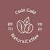

#  Code Café Landing Page 

## 📝 Descrição
Projeto de landing page responsiva utilizando html e CSS com base em um protótipo criado no Figma

[Projeto no Figma](https://www.figma.com/file/JXTJmNUyNAjg5GGQET9hQg/Projeto-Landing-Page-Code-Caf%C3%A9?node-id=0%3A1)

#### [📱Telinhas](https://github.com/BrunoAndradeDinis/CodeCafe#telinhas) | [👁‍🗨Funcionalidades do projeto](https://github.com/BrunoAndradeDinis/CodeCafe#funcionalidades-do-projeto) | [⚙ Tecnologias utilizadas](https://github.com/BrunoAndradeDinis/CodeCafe#-tecnologias-utilizadas) | [🚀 Rodando o projeto](https://github.com/BrunoAndradeDinis/CodeCafe#-rodando-o-projeto) | [👥Colaboradores](https://github.com/BrunoAndradeDinis/CodeCafe#colaboradores) | [🎯 Status do projeto](https://github.com/BrunoAndradeDinis/CodeCafe#-status-do-projeto)

## 📱Telinhas

### Web:
[](https://brunoandradedinis.github.io/CodeCafe/)

### MobileL:

[](https://brunoandradedinis.github.io/CodeCafe/)

### MobileS:

[](https://brunoandradedinis.github.io/CodeCafe/)

### Mobile Landscape:

[](https://brunoandradedinis.github.io/CodeCafe/)

### Tablet: 

[](https://brunoandradedinis.github.io/CodeCafe/)

## 👁‍🗨Funcionalidades do projeto

Projeto dividido em 3 partes contendo as seguintes informações
### 1º parte
- Cabeçalho
    - Logo
    - Navegação
        - Quem somos
        - Onde estamos
        - Contato
### 2º parte
- Conteúdo principal
    - Painel
        - painel com imagem
    - Seção com texto 1/2
        - Quem somos
        - Lorem Ipsum
    - Ladrilhos
        - Ladrilhos de imagens
    - Seção com texto 2/2
        - Onde estamos
        - Endereço
    - Contato
        - Contato
        - Dados para entrar em contato com o estabelecimento
### 3º parte
- Rodapé
    - Logo
    - Navegação
        - Quem somos
        - Onde estamos
        - Contato
    - Conteúdo de baixo
        - Redes sociais
        - Copyright

## ⚙ Tecnologias utilizadas
### Linguagens utilizadas:

- Html
- CSS

### IDE utilizada:

- VScode


# 🚀 Rodando o projeto

Clona aí pra analisar, é iniciante mas com atitude, pra rodar o projeto basta apenas clonar e executar o index.

```
git clone https://github.com/BrunoAndradeDinis/CodeCafe.git
```
Só abrir o index que é sucesso!

## 👥Colaboradores

Projeto realizado através do curso dos gêmeos  
[DevEmDobro](https://github.com/devemdobro)

## 🎯 Status do projeto

✅Finalizado!
